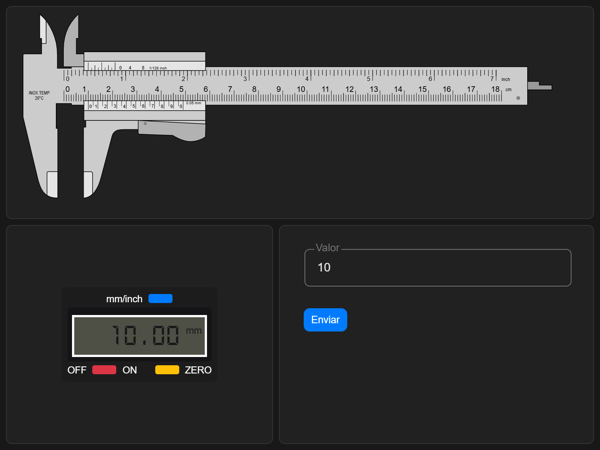
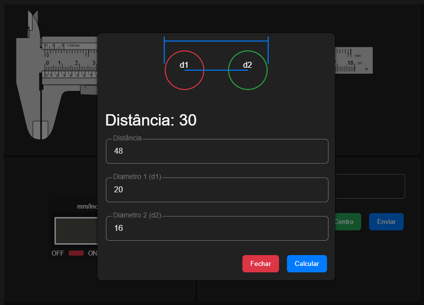

## Caliper (Paquímetro) 180 mm

### Inicio

### Modal: Calcular distância entre centros

### Fórmula para encontrar a distância entre os centros
# $P = W - \frac{D_a + D_b}{2}$
$P =$ Pitch 
$W =$ Width 
$D_a =$ Diameter A 
$D_b =$ Diameter B

## Referências
[Módulo digital](https://www.ifixit.com/products/digital-caliper)

[SVG modificado](https://pt.wikipedia.org/wiki/Ficheiro:Vernier_caliper.svg)

[Ícones de paquímetro criados por DinosoftLabs - Flaticon](https://www.flaticon.com/free-icons/caliper)